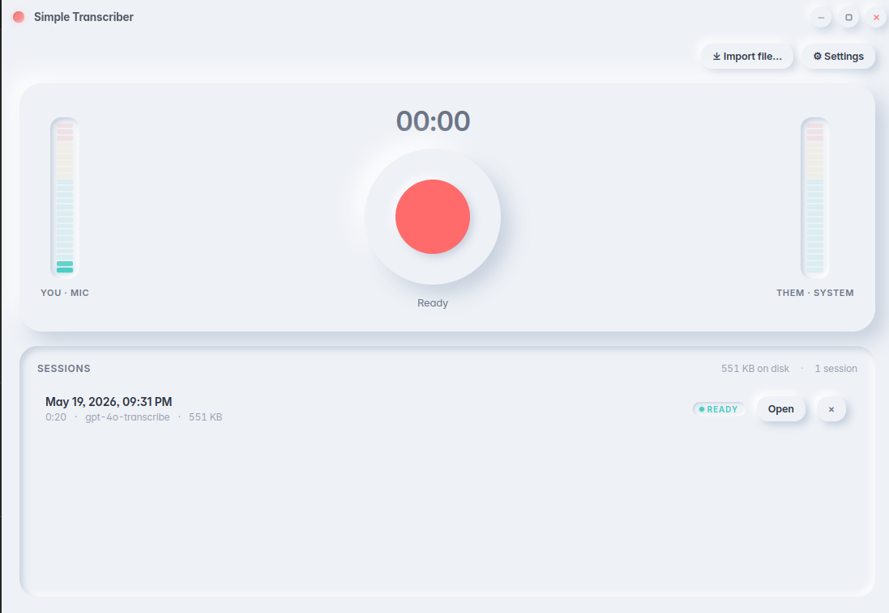

<div align="center">
  
</div>

# Simple Transcriber

Cross-platform desktop app (Linux / Windows / macOS) that records your microphone **and** the audio playing through your speakers at the same time, then produces a single time-ordered transcript via the OpenAI API. Replaces the OBS-record-then-CLI-transcribe workflow with one tool.

## Features

- 🎙️ **Dual-channel recording** — mic + system loopback captured simultaneously. The meeting app (Teams / Discord / Meet / Zoom) keeps working normally; we tap the OS-level monitor, not the device.
- 🎚️ **Live OBS-style level meters** — vertical segmented bars for "You · Mic" and "Them · System" with peak hold, so you can verify both sources are active before you hit record.
- 🧠 **Native PipeWire loopback on Linux** — `pw-record -P stream.capture.sink=true` against the sink's monitor, properly muxed with the mic via a two-pass ffmpeg pipeline. Works on Pulse-compat systems too.
- 📂 **Drag-and-drop import** — drop any audio or video file onto the window (mp3, wav, m4a, mp4, mov, mkv, webm…) and it gets transcribed via the same pipeline.
- 🎛️ **Auto-balanced mix** — both streams loudness-normalized to -16 LUFS and summed (`amix normalize=0` + alimiter). One clean mp3 sent to OpenAI, transcript flows in natural time order.
- ⚡ **Parallel chunked transcription** — 10-minute chunks with 2s overlap, 4 concurrent OpenAI requests by default. Ported from a battle-tested Python pipeline.
- 🔑 **Secure API key storage** — OS keychain via `keytar` (Keychain on macOS, Credential Manager on Windows, libsecret on Linux). Never on disk in plain text.
- 🌗 **Dark mode with system detection** — CSS-variable-driven theme, auto-follows your OS preference, manually toggleable in Settings.
- 💾 **Persistent history with storage telemetry** — SQLite-backed session list, per-session disk usage, total storage in Settings. Scales to hundreds of sessions.
- 🛟 **Crash recovery** — SQLite in WAL mode + startup orphan scan + graceful close handlers. If the app dies mid-recording, the next launch finishes the transcription with whatever audio was on disk.
- 🪟 **Custom title bar** — frameless window with neumorphic min/max/close buttons. macOS traffic lights preserved.
- 🎨 **Soft-white neumorphic UI** — indented surfaces, subtle shadows, accent coral. Designed to feel like a polished native app, not Yet Another Electron Web App.

## Quick start

```bash
git clone <repo>
cd simple_transcriber
npm install
npx electron-rebuild        # rebuild better-sqlite3 + keytar for Electron
npm run dev                 # launches Vite + Electron with HMR
```

First launch walks you through:
1. Welcome
2. Paste your OpenAI API key (validated, then stored in your OS keychain)
3. Pick your microphone — confirm the level bar moves
4. Pick the speaker output to capture — confirm the level bar moves when something plays
5. Done

The main screen has a big record button flanked by both level meters. Hit it, talk, hit it again. The transcript appears in the session list a few seconds later.

## Packaging

```bash
npm run package:linux       # .AppImage + .deb in release/
npm run package:win         # .exe (NSIS) in release/
npm run package:mac         # .dmg in release/
npm run package             # current OS
```

App icon is a single PNG at `assets/icon.png`; electron-builder generates platform-specific formats automatically.

## Where stuff lives

OS app data folder (`app.getPath('userData')`):

- **Linux:** `~/.config/Simple Transcriber/`
- **macOS:** `~/Library/Application Support/Simple Transcriber/`
- **Windows:** `%APPDATA%/Simple Transcriber/`

Inside:
```
sessions/
  2026-05-19_14-03-22/
    audio.webm          # mic recording (raw, preserved for re-mix)
    audio.mp3           # final mixed audio (the file sent to OpenAI)
    transcript.txt
    meta.json
index.sqlite            # session metadata, WAL-mode
```

## How the audio works

**Mic** — `getUserMedia` with `echoCancellation`, `noiseSuppression`, and `autoGainControl` all **disabled** so the WebRTC DSP doesn't fight whatever call app is also using the mic.

**System audio** —
- **Linux:** `pw-record -P stream.capture.sink=true --target=<sink.name>` writes raw PCM to `<session>/system.pcm` while you record. The `stream.capture.sink=true` property is critical — without it, pw-record connects to the sink's input ports and captures near-silence.
- **Windows:** `desktopCapturer` + `chromeMediaSource: 'desktop'` taps WASAPI loopback.
- **macOS:** BlackHole virtual driver as an `audioinput` device. Onboarding guides install.

**Mix** (at transcription time) —
1. Mic webm → clean mp3 with `loudnorm I=-16:TP=-1.5:LRA=11`
2. System pcm → clean mp3 with the same loudnorm
3. `amix=inputs=2:duration=shortest:normalize=0` + `alimiter=0.95` → final `audio.mp3`

Two-pass instead of single `filter_complex` because the WebM trailer is sometimes truncated by MediaRecorder and that crashes ffmpeg if the bad demux happens inside the mix step. See [ISSUES.md](ISSUES.md) for the full story.

## Coexistence with call apps

Both this app and your call app open the mic in **shared mode** (the same APIs Discord / Teams / Meet use). They don't steal the device from each other. Speaker capture goes through OS-level loopback / monitor — a separate path from playback — so the call app keeps playing audio normally while we record what it played.

## Architecture

Electron + React + TypeScript + Vite.

- **Main process** (`src/main/`) — Electron lifecycle, IPC, ffmpeg pipeline, OpenAI calls, SQLite, native PipeWire on Linux, theme + crash recovery.
- **Preload** (`src/preload/`) — `contextBridge` IPC surface only.
- **Renderer** (`src/renderer/`) — React UI, audio meters via Web Audio `AnalyserNode`, MediaRecorder for mic, soft-white neumorphic design system.

See [ISSUES.md](ISSUES.md) for the gotchas we hit and the fixes that stuck.

## License

MIT
